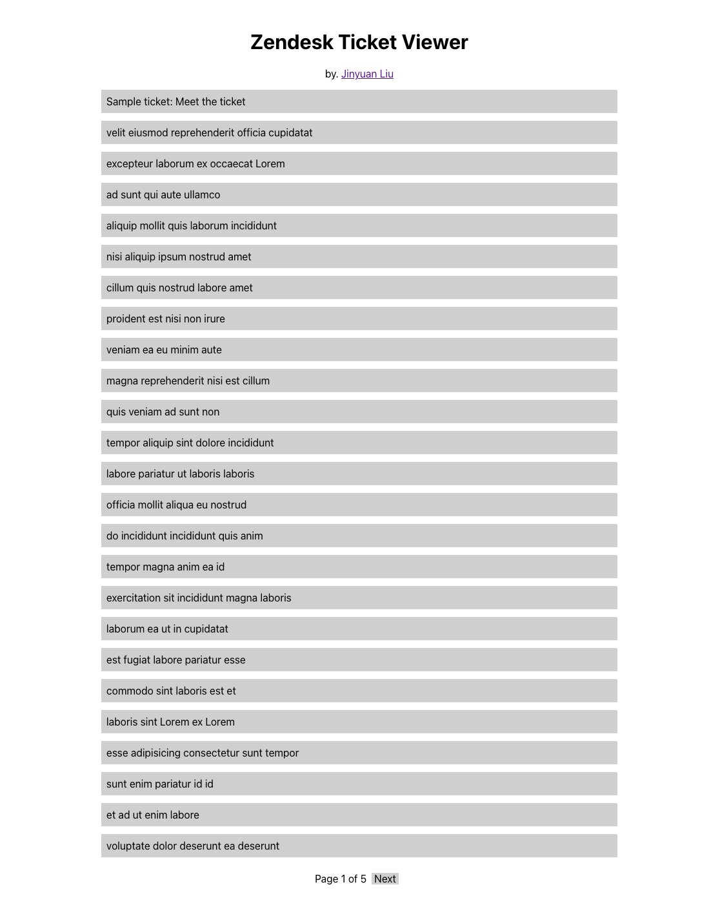
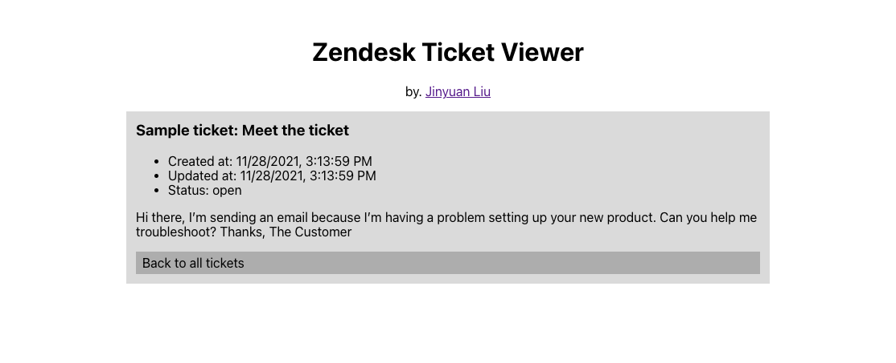
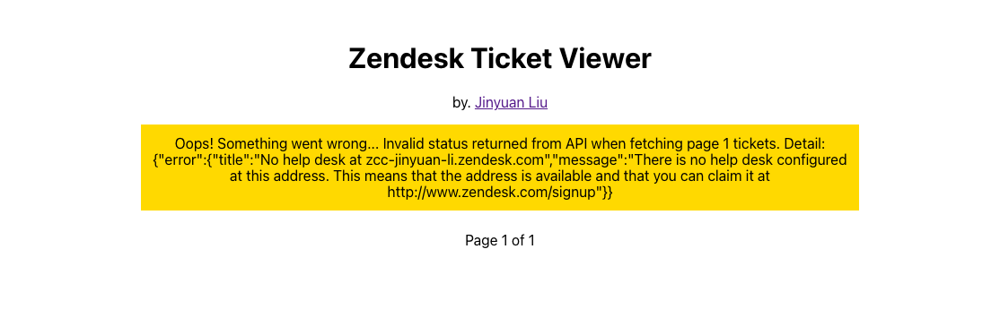

# Zendesk Ticket Viewer

## Introduction

This is Jinyuan Liu's submission of 2022 Zendesk Intern Coding Challenge. This Zendesk Ticket Viewer allows you to view tickets in your Zendesk account. 

This Zendesk Ticket Viewer will show 25 tickets per page, and can go next or previous page by clicking button at the end of page. Each ticket can be clicked, then the detail of ticket will display.

The backend service will return ticket with given ticket id (`/api/tickets/<ticket-id>`) or return all tickets (`/api/tickets`, 25 per page, use `page=2` to continue).

Both frontend and backend could handle error returned from Zendesk API (ex. invalid credential) and the backend service. Backend will return HTTP code 500 to indicate there some error occurred and frontend will detect it, then show prompt message.

## Environment

In this project, I use Python Flask to implement backend service and use React.js to create a simple frontend page.

My development platform uses `Python 3.7` and `Node.js v12.18.2`. Earlier versions maybe also work, but I did not test. What's more, `pip` and `npm` are also required to install dependencies. These should be alrealy installed on the machine once installed `Python` and `Node.js` successfully.

## Installation

To start this Zendesk Ticket Viewer, we need to install dependencies first.

1. Clone the project, then `cd zendesk-ticket-viewer`.
2. Install Python packages used to build Python backend. Just `cd ztv-backend && pip install -r requirements.txt`, then `pip` will install all we required.
3. Install node modules used to build React frontend. Just `cd ztv-frontend && yarn install`, then `npm` will install all we need.

## Usage

Since this is a web project, so we need to build and start both frontend and backend separately.

1. Build frontend website. Just `cd ztv-frontend && yarn build`, then the frontend website will be built in folder `ztv-frontend/build`.
2. Start backend service. Just `cd ztv-backend && python app.py -u <user> -t <token> -d <domain>`, then the web service will start at `1437` port by default. You can change it via assign argument `-p <port>`. `<user>` is your login username and `<domain>` is the subdomain of your app account. `<token>` can be activated at `https://<domain>.zendesk.com/agent/admin/api/settings/tokens` **FOR ZENDESK GRADERS**: the username, token and sub domain info of my account has been sent to you via email, so you can use those info to start backend service.

All done! Now you can visit `http://localhost:1437/` to use this Zendesk Ticket Viewer. Enjoy it!

Notice: When backend service start, it will use the built version of frontend website, so be sure that build frontend website before start backend service.

PS: In development mode, frontend will by default use `http://localhost:1437` as the backend service base URL. To change it, you should manually change file [ztv-frontend/src/App.js](ztv-frontend/src/App.js) (line 21).

## Test

For test, I use some test tickets provided by Zendesk. You can see them in [tickets.json](tickets.json).

Also, there are some unit tests written in React frontend. To run these tests, please `cd ztv-frontend && yarn test`. If all goes well, all tests will be passed.

## License

[MIT](LICENSE)
